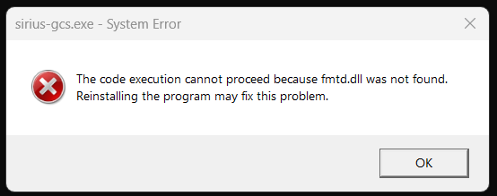

# sirius-gcs

Sirius GCS is a ground control station application for managing and monitoring rocket flights. It provides features such as real-time mapping, data visualization, and command transmission.

## Table of Contents

- [Setup](#setup)
- [Add a new C++ file/folder to the VS2022 project](#add-a-new-c-filefolder-to-the-vs2022-project)
- [Enable format on save in VS2022 (ClangFormat)](#enable-format-on-save-in-vs2022-clangformat)
- [Debugging](#debugging)

## Setup

1. Install Visual Studio 2022.
2. Run `git clone https://github.com/SiriusUdS/sirius-gcs.git`.
3. Execute the `setup.bat` script in the **setup** folder.
4. Open the **sirius-gcs.sln** solution in Visual Studio 2022.
5. Compile and run.

## Add a new C++ file/folder to the VS2022 project

1. Create new file/folder in File Explorer at the desired location in the **src** folder.
2. If a new folder was created:
    1. Open the **sirius-gcs/premake.lua** file in a text editor.
    2. In the `includedirs` list under `workspace "sirius-gcs"`, add the relative path to your new folder.
    3. Save your changes to the **sirius-gcs/premake.lua** file.
3. Execute the **sirius-gcs/setup/generate_vs_solution.bat** script to regenerate the Visual Studio solution.
4. Either restart Visual Studio, or click the **Reload All** button in the window that popped-up in Visual Studio.
    - *If you haven't restarted Visual Studio and no window pop-up appears, it means no changes were detected. Make sure you followed step 2 correctly.*
5. The new files and/or folders should appear in the **Solution Explorer** window.

## Enable format on save in VS2022 (ClangFormat)

In Visual Studio:
1. In **Tools > Options > Text Editor > C/C++ > Code Style > Formatting > General**, check the **Enable ClangFormat support** option, and under it check the **Enable ClangFormat for all formatting scenarios** option.
2. In **Analyze > Code Cleanup > Configure Code Cleanup**, select the default profile in the left window. Select the **Format Document (C++)** fixer in the bottom window and then click the arrow pointing up button. Make sure the fixer appears in the upper window.
3. The code should now get formatted automatically when saving.

## Debugging

If you come across the following error when trying to compile/run the program:

Delete the entire **sirius-gcs/out** folder before recompiling and running the program.
